# Polymarket Dump & Hedge 自动化交易系统
## 架构图与时序图

---

## 1. 系统架构图

### 1.1 整体架构 (C4 Context)

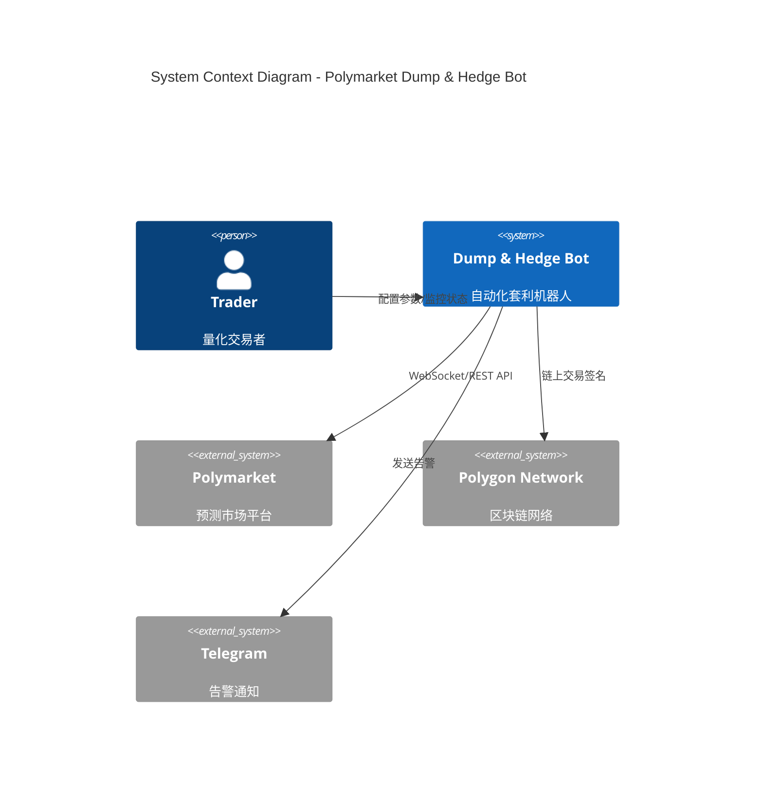
```mermaid
C4Context
    title System Context Diagram - Polymarket Dump & Hedge Bot

    Person(trader, "Trader", "量化交易者")
    
    System(bot, "Dump & Hedge Bot", "自动化套利机器人")
    
    System_Ext(polymarket, "Polymarket", "预测市场平台")
    System_Ext(polygon, "Polygon Network", "区块链网络")
    System_Ext(telegram, "Telegram", "告警通知")
    
    Rel(trader, bot, "配置参数/监控状态")
    Rel(bot, polymarket, "WebSocket/REST API")
    Rel(bot, polygon, "链上交易签名")
    Rel(bot, telegram, "发送告警")
```

### 1.2 容器架构 (C4 Container)

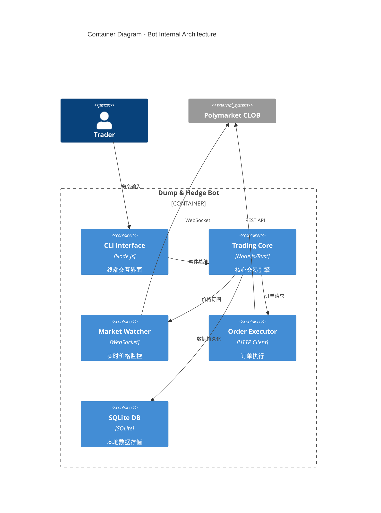
```mermaid
C4Container
    title Container Diagram - Bot Internal Architecture

    Person(trader, "Trader")
    
    Container_Boundary(bot, "Dump & Hedge Bot") {
        Container(cli, "CLI Interface", "Node.js", "终端交互界面")
        Container(core, "Trading Core", "Node.js/Rust", "核心交易引擎")
        Container(watcher, "Market Watcher", "WebSocket", "实时价格监控")
        Container(executor, "Order Executor", "HTTP Client", "订单执行")
        Container(db, "SQLite DB", "SQLite", "本地数据存储")
    }
    
    System_Ext(polymarket, "Polymarket CLOB")
    
    Rel(trader, cli, "命令输入")
    Rel(cli, core, "事件总线")
    Rel(core, watcher, "价格订阅")
    Rel(core, executor, "订单请求")
    Rel(watcher, polymarket, "WebSocket")
    Rel(executor, polymarket, "REST API")
    Rel(core, db, "数据持久化")
```

### 1.3 组件架构图

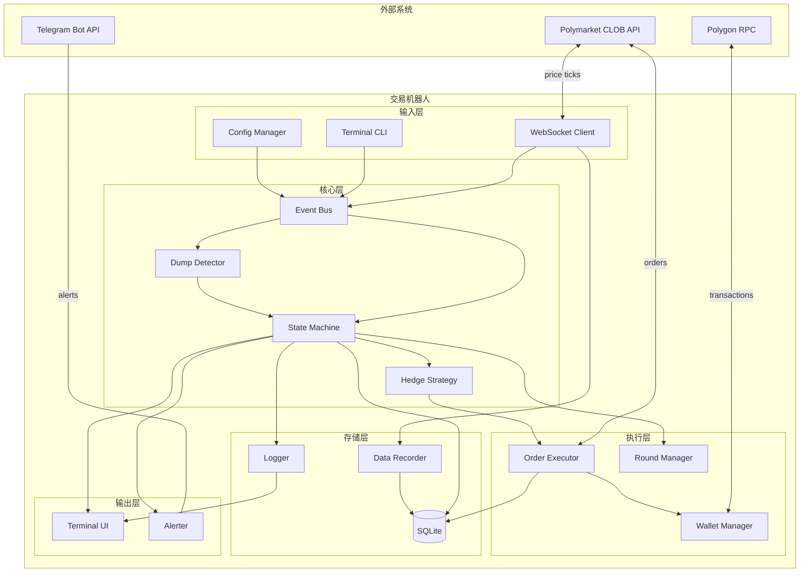
```mermaid
flowchart TB
    subgraph External["外部系统"]
        PM[Polymarket CLOB API]
        PG[Polygon RPC]
        TG[Telegram Bot API]
    end

    subgraph Bot["交易机器人"]
        subgraph Input["输入层"]
            WS[WebSocket Client]
            CLI[Terminal CLI]
            CFG[Config Manager]
        end

        subgraph Core["核心层"]
            EB[Event Bus]
            SM[State Machine]
            DD[Dump Detector]
            HS[Hedge Strategy]
        end

        subgraph Execution["执行层"]
            OE[Order Executor]
            WM[Wallet Manager]
            RM[Round Manager]
        end

        subgraph Storage["存储层"]
            DB[(SQLite)]
            LOG[Logger]
            REC[Data Recorder]
        end

        subgraph Output["输出层"]
            UI[Terminal UI]
            ALT[Alerter]
        end
    end

    PM <-->|price ticks| WS
    PM <-->|orders| OE
    PG <-->|transactions| WM
    TG <---|alerts| ALT

    WS --> EB
    CLI --> EB
    CFG --> EB
    
    EB --> SM
    EB --> DD
    SM --> HS
    DD --> SM
    
    HS --> OE
    SM --> RM
    OE --> WM
    
    SM --> DB
    OE --> DB
    WS --> REC
    REC --> DB
    SM --> LOG
    
    SM --> UI
    SM --> ALT
    LOG --> UI
```

---

## 2. 状态机图

### 2.1 交易周期状态机

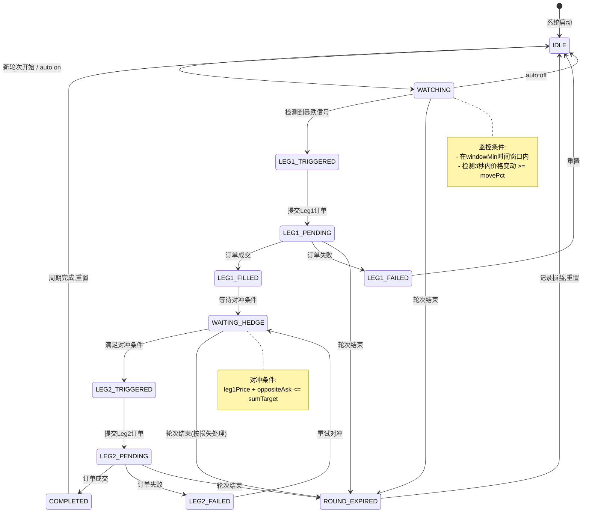
```mermaid
stateDiagram-v2
    [*] --> IDLE: 系统启动

    IDLE --> WATCHING: 新轮次开始 / auto on
    
    WATCHING --> LEG1_TRIGGERED: 检测到暴跌信号
    WATCHING --> IDLE: auto off
    WATCHING --> ROUND_EXPIRED: 轮次结束
    
    LEG1_TRIGGERED --> LEG1_PENDING: 提交Leg1订单
    
    LEG1_PENDING --> LEG1_FILLED: 订单成交
    LEG1_PENDING --> LEG1_FAILED: 订单失败
    LEG1_PENDING --> ROUND_EXPIRED: 轮次结束
    
    LEG1_FILLED --> WAITING_HEDGE: 等待对冲条件
    
    WAITING_HEDGE --> LEG2_TRIGGERED: 满足对冲条件
    WAITING_HEDGE --> ROUND_EXPIRED: 轮次结束(按损失处理)
    
    LEG2_TRIGGERED --> LEG2_PENDING: 提交Leg2订单
    
    LEG2_PENDING --> COMPLETED: 订单成交
    LEG2_PENDING --> LEG2_FAILED: 订单失败
    LEG2_PENDING --> ROUND_EXPIRED: 轮次结束
    
    LEG1_FAILED --> IDLE: 重置
    LEG2_FAILED --> WAITING_HEDGE: 重试对冲
    
    COMPLETED --> IDLE: 周期完成,重置
    ROUND_EXPIRED --> IDLE: 记录损益,重置
    
    note right of WATCHING
        监控条件:
        - 在windowMin时间窗口内
        - 检测3秒内价格变动 >= movePct
    end note
    
    note right of WAITING_HEDGE
        对冲条件:
        leg1Price + oppositeAsk <= sumTarget
    end note
```

### 2.2 WebSocket连接状态机

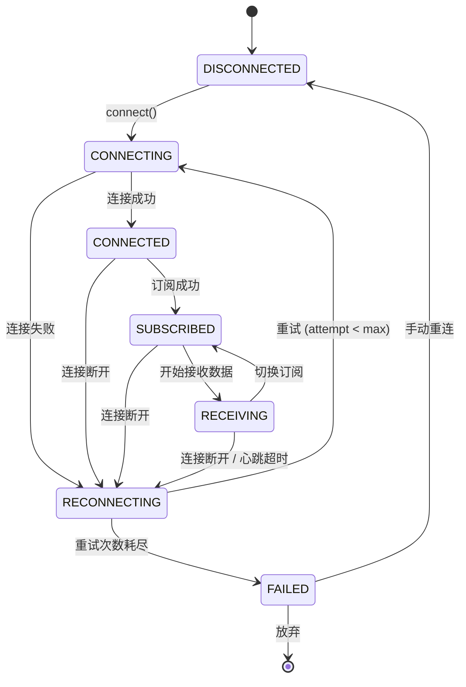
```mermaid
stateDiagram-v2
    [*] --> DISCONNECTED
    
    DISCONNECTED --> CONNECTING: connect()
    
    CONNECTING --> CONNECTED: 连接成功
    CONNECTING --> RECONNECTING: 连接失败
    
    CONNECTED --> SUBSCRIBED: 订阅成功
    CONNECTED --> RECONNECTING: 连接断开
    
    SUBSCRIBED --> RECEIVING: 开始接收数据
    SUBSCRIBED --> RECONNECTING: 连接断开
    
    RECEIVING --> RECONNECTING: 连接断开 / 心跳超时
    RECEIVING --> SUBSCRIBED: 切换订阅
    
    RECONNECTING --> CONNECTING: 重试 (attempt < max)
    RECONNECTING --> FAILED: 重试次数耗尽
    
    FAILED --> DISCONNECTED: 手动重连
    FAILED --> [*]: 放弃
```

---

## 3. 时序图

### 3.1 完整交易周期时序图

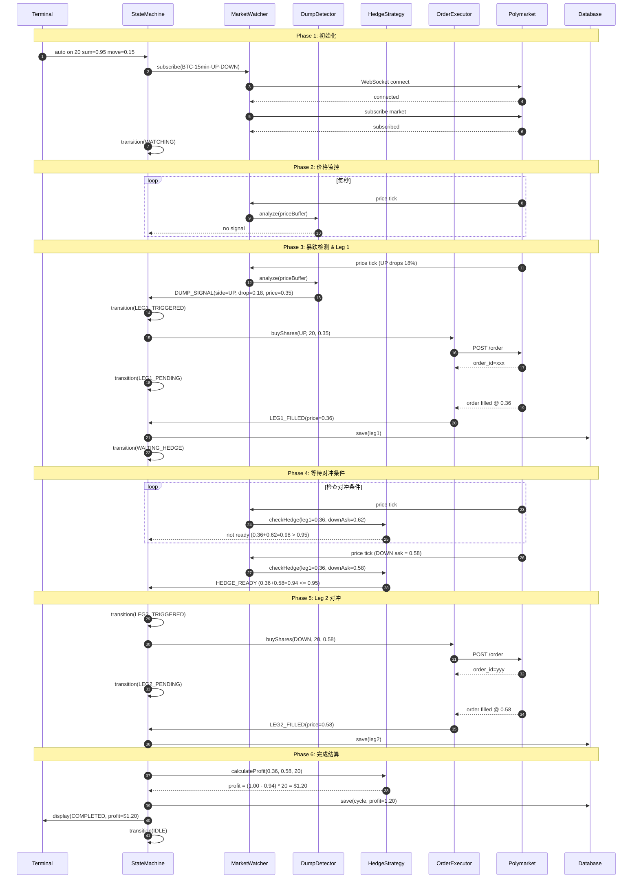
```mermaid
sequenceDiagram
    autonumber
    participant T as Terminal
    participant SM as StateMachine
    participant MW as MarketWatcher
    participant DD as DumpDetector
    participant HS as HedgeStrategy
    participant OE as OrderExecutor
    participant PM as Polymarket
    participant DB as Database

    Note over T,DB: Phase 1: 初始化
    T->>SM: auto on 20 sum=0.95 move=0.15
    SM->>MW: subscribe(BTC-15min-UP-DOWN)
    MW->>PM: WebSocket connect
    PM-->>MW: connected
    MW->>PM: subscribe market
    PM-->>MW: subscribed
    SM->>SM: transition(WATCHING)

    Note over T,DB: Phase 2: 价格监控
    loop 每秒
        PM->>MW: price tick
        MW->>DD: analyze(priceBuffer)
        DD-->>SM: no signal
    end

    Note over T,DB: Phase 3: 暴跌检测 & Leg 1
    PM->>MW: price tick (UP drops 18%)
    MW->>DD: analyze(priceBuffer)
    DD->>SM: DUMP_SIGNAL(side=UP, drop=0.18, price=0.35)
    SM->>SM: transition(LEG1_TRIGGERED)
    SM->>OE: buyShares(UP, 20, 0.35)
    OE->>PM: POST /order
    PM-->>OE: order_id=xxx
    SM->>SM: transition(LEG1_PENDING)
    PM-->>OE: order filled @ 0.36
    OE->>SM: LEG1_FILLED(price=0.36)
    SM->>DB: save(leg1)
    SM->>SM: transition(WAITING_HEDGE)

    Note over T,DB: Phase 4: 等待对冲条件
    loop 检查对冲条件
        PM->>MW: price tick
        MW->>HS: checkHedge(leg1=0.36, downAsk=0.62)
        HS-->>SM: not ready (0.36+0.62=0.98 > 0.95)
    end

    PM->>MW: price tick (DOWN ask = 0.58)
    MW->>HS: checkHedge(leg1=0.36, downAsk=0.58)
    HS->>SM: HEDGE_READY (0.36+0.58=0.94 <= 0.95)

    Note over T,DB: Phase 5: Leg 2 对冲
    SM->>SM: transition(LEG2_TRIGGERED)
    SM->>OE: buyShares(DOWN, 20, 0.58)
    OE->>PM: POST /order
    PM-->>OE: order_id=yyy
    SM->>SM: transition(LEG2_PENDING)
    PM-->>OE: order filled @ 0.58
    OE->>SM: LEG2_FILLED(price=0.58)
    SM->>DB: save(leg2)
    
    Note over T,DB: Phase 6: 完成结算
    SM->>HS: calculateProfit(0.36, 0.58, 20)
    HS-->>SM: profit = (1.00 - 0.94) * 20 = $1.20
    SM->>DB: save(cycle, profit=1.20)
    SM->>T: display(COMPLETED, profit=$1.20)
    SM->>SM: transition(IDLE)
```

### 3.2 暴跌检测详细时序图

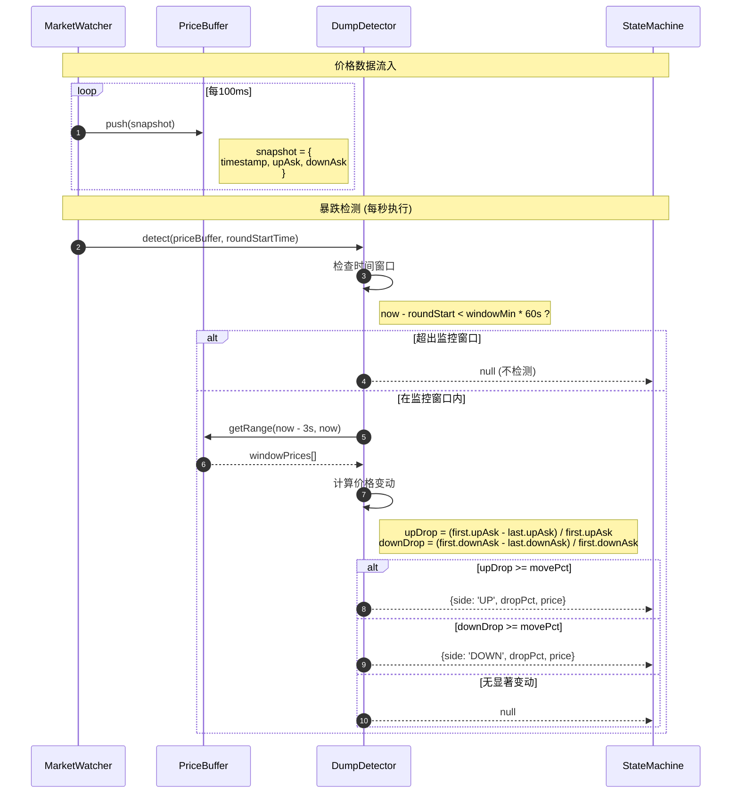
```mermaid
sequenceDiagram
    autonumber
    participant MW as MarketWatcher
    participant PB as PriceBuffer
    participant DD as DumpDetector
    participant SM as StateMachine

    Note over MW,SM: 价格数据流入
    
    loop 每100ms
        MW->>PB: push(snapshot)
        Note right of PB: snapshot = {<br/>timestamp, upAsk, downAsk<br/>}
    end

    Note over MW,SM: 暴跌检测 (每秒执行)
    
    MW->>DD: detect(priceBuffer, roundStartTime)
    
    DD->>DD: 检查时间窗口
    Note right of DD: now - roundStart < windowMin * 60s ?
    
    alt 超出监控窗口
        DD-->>SM: null (不检测)
    else 在监控窗口内
        DD->>PB: getRange(now - 3s, now)
        PB-->>DD: windowPrices[]
        
        DD->>DD: 计算价格变动
        Note right of DD: upDrop = (first.upAsk - last.upAsk) / first.upAsk<br/>downDrop = (first.downAsk - last.downAsk) / first.downAsk
        
        alt upDrop >= movePct
            DD-->>SM: {side: 'UP', dropPct, price}
        else downDrop >= movePct
            DD-->>SM: {side: 'DOWN', dropPct, price}
        else 无显著变动
            DD-->>SM: null
        end
    end
```

### 3.3 轮次切换时序图

```mermaid
sequenceDiagram
    autonumber
    participant PM as Polymarket
    participant RM as RoundManager
    participant SM as StateMachine
    participant DB as Database
    participant ALT as Alerter

    PM->>RM: round_change event
    RM->>RM: detectNewRound(newSlug)
    
    alt 有未完成的Leg1
        RM->>SM: ROUND_EXPIRED
        SM->>SM: transition(ROUND_EXPIRED)
        SM->>DB: markCycleLoss(currentCycle)
        SM->>ALT: sendAlert("Leg1未对冲，按损失处理")
    end
    
    RM->>SM: NEW_ROUND(newSlug)
    SM->>SM: resetState()
    SM->>SM: transition(IDLE)
    
    alt 自动模式开启
        SM->>SM: transition(WATCHING)
    end
```

### 3.4 订单执行时序图

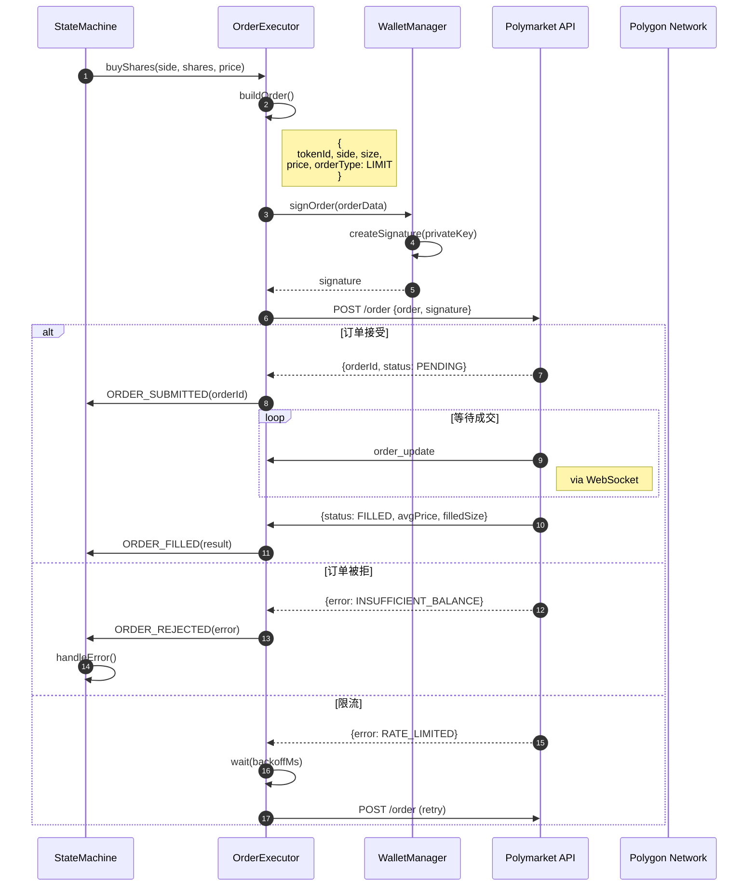
```mermaid
sequenceDiagram
    autonumber
    participant SM as StateMachine
    participant OE as OrderExecutor
    participant WM as WalletManager
    participant PM as Polymarket API
    participant PG as Polygon Network

    SM->>OE: buyShares(side, shares, price)
    
    OE->>OE: buildOrder()
    Note right of OE: {<br/>tokenId, side, size,<br/>price, orderType: LIMIT<br/>}
    
    OE->>WM: signOrder(orderData)
    WM->>WM: createSignature(privateKey)
    WM-->>OE: signature
    
    OE->>PM: POST /order {order, signature}
    
    alt 订单接受
        PM-->>OE: {orderId, status: PENDING}
        OE->>SM: ORDER_SUBMITTED(orderId)
        
        loop 等待成交
            PM->>OE: order_update
            Note right of PM: via WebSocket
        end
        
        PM->>OE: {status: FILLED, avgPrice, filledSize}
        OE->>SM: ORDER_FILLED(result)
        
    else 订单被拒
        PM-->>OE: {error: INSUFFICIENT_BALANCE}
        OE->>SM: ORDER_REJECTED(error)
        SM->>SM: handleError()
        
    else 限流
        PM-->>OE: {error: RATE_LIMITED}
        OE->>OE: wait(backoffMs)
        OE->>PM: POST /order (retry)
    end
```

---

## 4. 数据流图

### 4.1 价格数据流

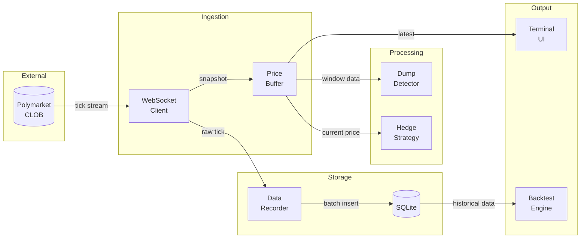
```mermaid
flowchart LR
    subgraph External
        PM[(Polymarket<br/>CLOB)]
    end

    subgraph Ingestion
        WS[WebSocket<br/>Client]
        PB[Price<br/>Buffer]
    end

    subgraph Processing
        DD[Dump<br/>Detector]
        HS[Hedge<br/>Strategy]
    end

    subgraph Storage
        DB[(SQLite)]
        REC[Data<br/>Recorder]
    end

    subgraph Output
        UI[Terminal<br/>UI]
        BT[Backtest<br/>Engine]
    end

    PM -->|tick stream| WS
    WS -->|snapshot| PB
    PB -->|window data| DD
    PB -->|current price| HS
    WS -->|raw tick| REC
    REC -->|batch insert| DB
    DB -->|historical data| BT
    PB -->|latest| UI
```

### 4.2 交易执行数据流

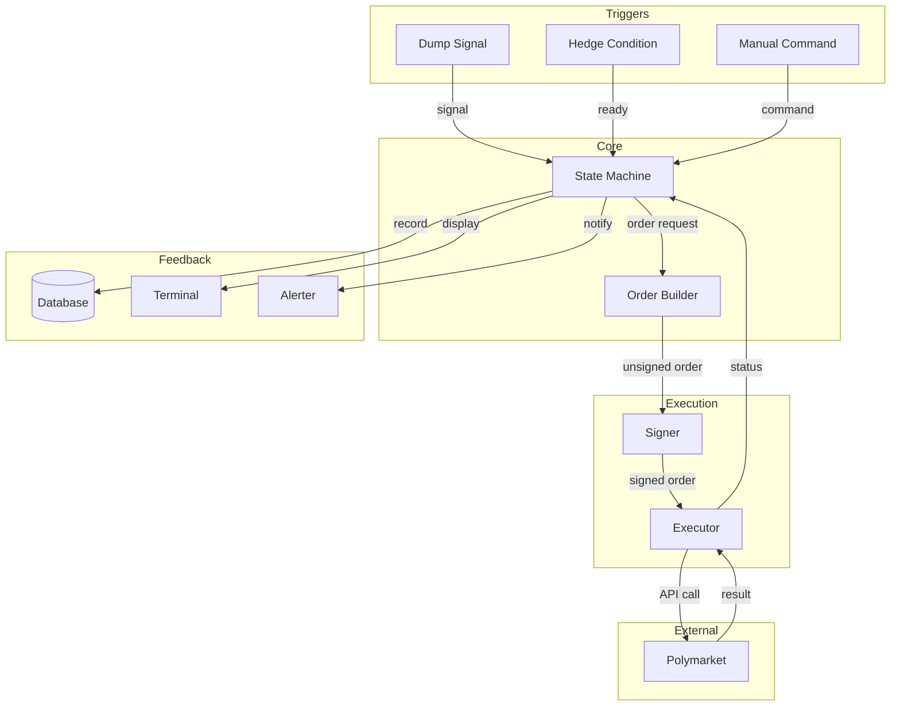
```mermaid
flowchart TB
    subgraph Triggers
        DD[Dump Signal]
        HS[Hedge Condition]
        MC[Manual Command]
    end

    subgraph Core
        SM[State Machine]
        OB[Order Builder]
    end

    subgraph Execution
        SN[Signer]
        EX[Executor]
    end

    subgraph External
        PM[Polymarket]
    end

    subgraph Feedback
        DB[(Database)]
        UI[Terminal]
        ALT[Alerter]
    end

    DD -->|signal| SM
    HS -->|ready| SM
    MC -->|command| SM
    
    SM -->|order request| OB
    OB -->|unsigned order| SN
    SN -->|signed order| EX
    EX -->|API call| PM
    
    PM -->|result| EX
    EX -->|status| SM
    
    SM -->|record| DB
    SM -->|display| UI
    SM -->|notify| ALT
```

---

## 5. 部署架构图

### 5.1 单机部署

```mermaid
flowchart TB
    subgraph Host["Raspberry Pi / VPS"]
        subgraph Docker["Docker Container"]
            BOT[Trading Bot]
            DB[(SQLite)]
        end
        
        subgraph Volumes["Persistent Volumes"]
            LOGS[/logs]
            DATA[/data]
            CFG[/config]
        end
    end

    subgraph Monitoring
        TG[Telegram Bot]
        PROM[Prometheus]
        GRAF[Grafana]
    end

    subgraph External
        PM[Polymarket]
        PG[Polygon RPC]
    end

    BOT <--> PM
    BOT <--> PG
    BOT --> TG
    BOT --> PROM
    PROM --> GRAF
    BOT --> DB
    DB --> DATA
    BOT --> LOGS
    CFG --> BOT
```

### 5.2 高可用部署 (Future)

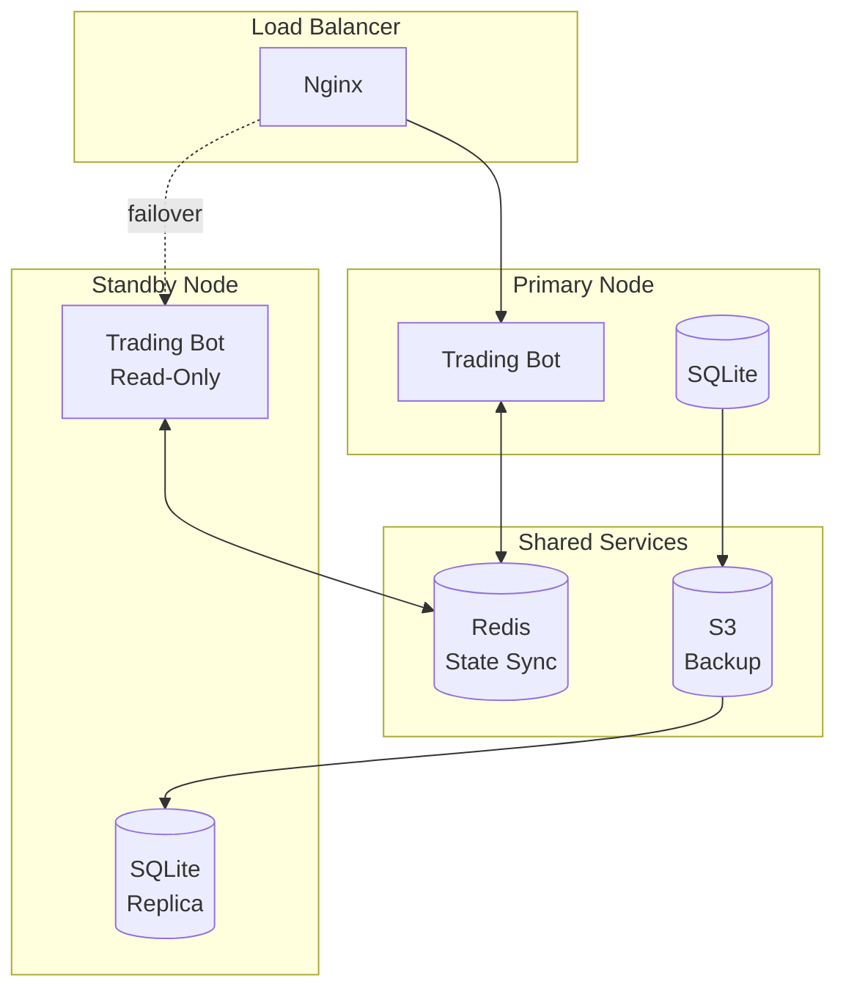
```mermaid
flowchart TB
    subgraph LB["Load Balancer"]
        NG[Nginx]
    end

    subgraph Primary["Primary Node"]
        BOT1[Trading Bot]
        DB1[(SQLite)]
    end

    subgraph Standby["Standby Node"]
        BOT2[Trading Bot<br/>Read-Only]
        DB2[(SQLite<br/>Replica)]
    end

    subgraph Shared["Shared Services"]
        REDIS[(Redis<br/>State Sync)]
        S3[(S3<br/>Backup)]
    end

    NG --> BOT1
    NG -.->|failover| BOT2
    BOT1 <--> REDIS
    BOT2 <--> REDIS
    DB1 --> S3
    S3 --> DB2
```

---

## 6. 类图

### 6.1 核心类结构

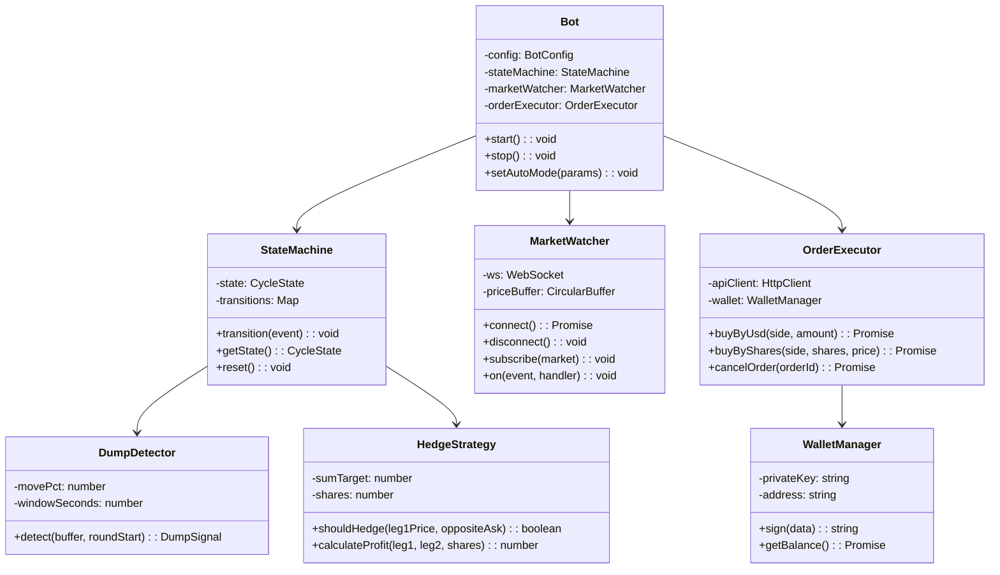
```mermaid
classDiagram
    class Bot {
        -config: BotConfig
        -stateMachine: StateMachine
        -marketWatcher: MarketWatcher
        -orderExecutor: OrderExecutor
        +start(): void
        +stop(): void
        +setAutoMode(params): void
    }

    class StateMachine {
        -state: CycleState
        -transitions: Map
        +transition(event): void
        +getState(): CycleState
        +reset(): void
    }

    class MarketWatcher {
        -ws: WebSocket
        -priceBuffer: CircularBuffer
        +connect(): Promise
        +disconnect(): void
        +subscribe(market): void
        +on(event, handler): void
    }

    class DumpDetector {
        -movePct: number
        -windowSeconds: number
        +detect(buffer, roundStart): DumpSignal
    }

    class HedgeStrategy {
        -sumTarget: number
        -shares: number
        +shouldHedge(leg1Price, oppositeAsk): boolean
        +calculateProfit(leg1, leg2, shares): number
    }

    class OrderExecutor {
        -apiClient: HttpClient
        -wallet: WalletManager
        +buyByUsd(side, amount): Promise
        +buyByShares(side, shares, price): Promise
        +cancelOrder(orderId): Promise
    }

    class WalletManager {
        -privateKey: string
        -address: string
        +sign(data): string
        +getBalance(): Promise
    }

    Bot --> StateMachine
    Bot --> MarketWatcher
    Bot --> OrderExecutor
    StateMachine --> DumpDetector
    StateMachine --> HedgeStrategy
    OrderExecutor --> WalletManager
```

### 6.2 数据模型类图

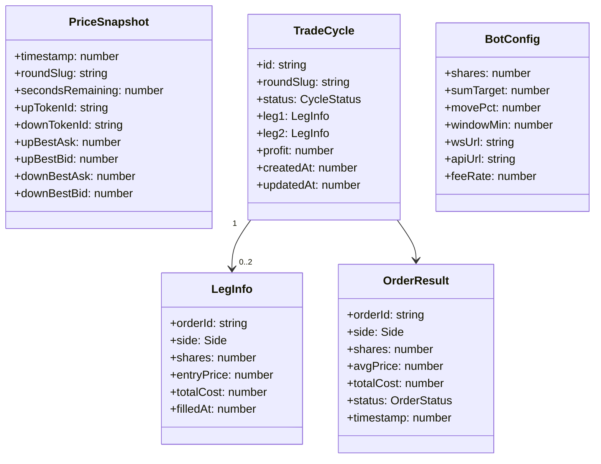
```mermaid
classDiagram
    class PriceSnapshot {
        +timestamp: number
        +roundSlug: string
        +secondsRemaining: number
        +upTokenId: string
        +downTokenId: string
        +upBestAsk: number
        +upBestBid: number
        +downBestAsk: number
        +downBestBid: number
    }

    class TradeCycle {
        +id: string
        +roundSlug: string
        +status: CycleStatus
        +leg1: LegInfo
        +leg2: LegInfo
        +profit: number
        +createdAt: number
        +updatedAt: number
    }

    class LegInfo {
        +orderId: string
        +side: Side
        +shares: number
        +entryPrice: number
        +totalCost: number
        +filledAt: number
    }

    class OrderResult {
        +orderId: string
        +side: Side
        +shares: number
        +avgPrice: number
        +totalCost: number
        +status: OrderStatus
        +timestamp: number
    }

    class BotConfig {
        +shares: number
        +sumTarget: number
        +movePct: number
        +windowMin: number
        +wsUrl: string
        +apiUrl: string
        +feeRate: number
    }

    TradeCycle "1" --> "0..2" LegInfo
    TradeCycle --> OrderResult
```

---

## 7. ER图

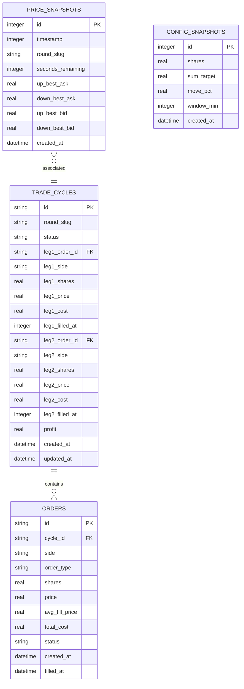
```mermaid
erDiagram
    PRICE_SNAPSHOTS {
        integer id PK
        integer timestamp
        string round_slug
        integer seconds_remaining
        real up_best_ask
        real down_best_ask
        real up_best_bid
        real down_best_bid
        datetime created_at
    }

    TRADE_CYCLES {
        string id PK
        string round_slug
        string status
        string leg1_order_id FK
        string leg1_side
        real leg1_shares
        real leg1_price
        real leg1_cost
        integer leg1_filled_at
        string leg2_order_id FK
        string leg2_side
        real leg2_shares
        real leg2_price
        real leg2_cost
        integer leg2_filled_at
        real profit
        datetime created_at
        datetime updated_at
    }

    ORDERS {
        string id PK
        string cycle_id FK
        string side
        string order_type
        real shares
        real price
        real avg_fill_price
        real total_cost
        string status
        datetime created_at
        datetime filled_at
    }

    CONFIG_SNAPSHOTS {
        integer id PK
        real shares
        real sum_target
        real move_pct
        integer window_min
        datetime created_at
    }

    TRADE_CYCLES ||--o{ ORDERS : contains
    PRICE_SNAPSHOTS }o--|| TRADE_CYCLES : associated
```

---

## 8. 回测流程图

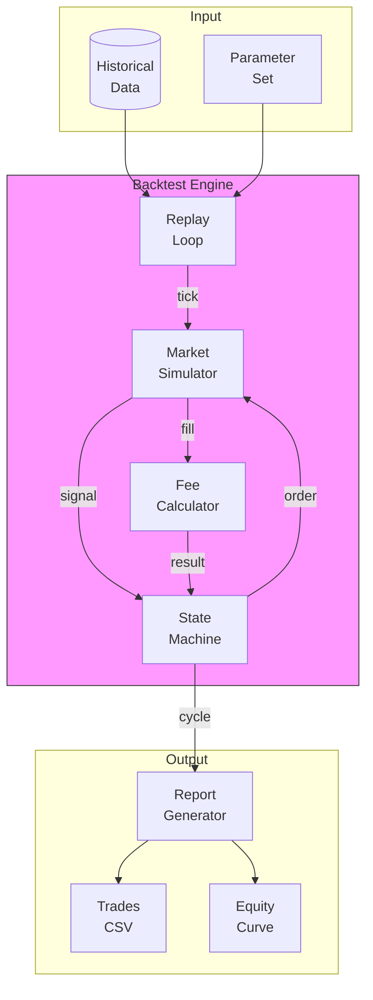
```mermaid
flowchart TB
    subgraph Input
        DB[(Historical<br/>Data)]
        CFG[Parameter<br/>Set]
    end

    subgraph Engine["Backtest Engine"]
        RL[Replay<br/>Loop]
        SIM[Market<br/>Simulator]
        FSM[State<br/>Machine]
        FEE[Fee<br/>Calculator]
    end

    subgraph Output
        RPT[Report<br/>Generator]
        CSV[Trades<br/>CSV]
        CHART[Equity<br/>Curve]
    end

    DB --> RL
    CFG --> RL
    RL -->|tick| SIM
    SIM -->|signal| FSM
    FSM -->|order| SIM
    SIM -->|fill| FEE
    FEE -->|result| FSM
    FSM -->|cycle| RPT
    RPT --> CSV
    RPT --> CHART

    style Engine fill:#f9f,stroke:#333
```
